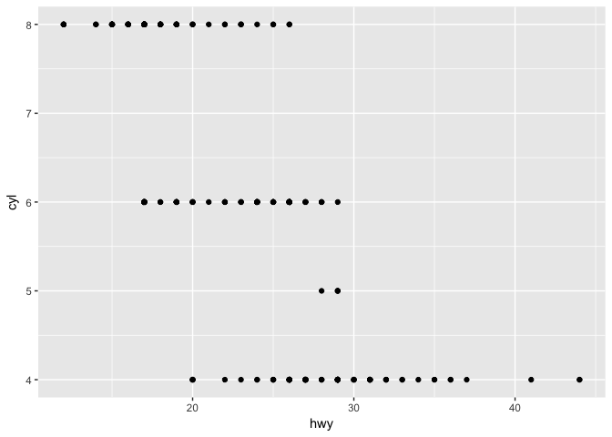
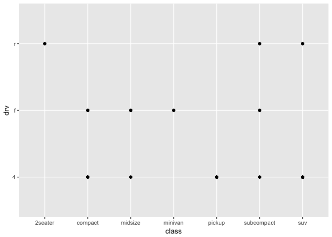

3.2.4 Solutions
================

The following questions stem from [Section 3.2](http://r4ds.had.co.nz/data-visualisation.html#first-steps) of Chapter 3 (Data Visualization) in [R for Data Science](http://r4ds.had.co.nz/). The "solutions" offer some answers. Issues and pull requests are very welcome here.

### Load packages

``` r
library(tidyverse) 
```

#### 1. Run `ggplot(data = mpg)`. What do you see?

An empty graph, appearing as a grey box in the Plots tab of RStudio. Think of this graph as a blank canvas that you can use as a foundation for plots.

``` r
ggplot(data = mpg)
```


#### 2. How many rows are in `mtcars`? How many columns?

Here are three ways to get the answer (32 rows and 11 columns):

1.  `str(mtcars)`
2.  `nrow(mtcars)` along with `ncol(mtcars)`
3.  `dim(mtcars)`

#### 3. What does the `drv` variable describe? Read the help `?mpg` to find out.

`drv` describes whether a vehicle has front-, rear-, or four-wheel drive. These values are coded `f`, `r`, and `4`, respectively.

#### 4. Make a scatterplot of `hwy` vs `cyl`.

``` r
ggplot(data = mpg) +
  geom_point(mapping = aes(x = hwy, y = cyl))
```



#### 5. What happens if you make a scatterplot of `class` vs `drv`? Why is the plot not useful?

``` r
ggplot(data = mpg) +
  geom_point(mapping = aes(x = class, y = drv))
```



You get a scatterplot with categorical variables assigned to both the x and y axes. The scatterplot displays the combinations of class and drive train that exist in the data. This information isn't very helpful because you can't see how many vehicles fall within a given class-and-drive-train combination.

To make the plot useful, you need to jitter the points with `geom_jitter`.

``` r
ggplot(data = mpg) +
  geom_jitter(mapping = aes(x = class, y = drv), width = 0.30, height = 0.30)
```


