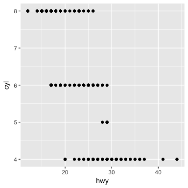

3.2.4 Exercise Solutions
================

The following questions and "solutions" stem from [Section 3.2](http://r4ds.had.co.nz/data-visualisation.html#first-steps) of the Data Visualization chapter in [R for Data Science](http://r4ds.had.co.nz/).

### Load packages

``` r
library(tidyverse) 
```

**1. Run `ggplot(data = mpg)`. What do you see?**

An empty graph, which appears as a grey box in the Plots tab of RStudio. You can think of this graph as a blank canvas that you can use as a foundation for plots.

**2. How many rows are in `mtcars`? How many columns?**

`str(mtcars)`, `nrow(mtcars)` in combination with `ncol(mtcars)`, and `dim(mtcars)` represent three ways you can arrive at the answer of 32 rows and 11 columns.

**3. What does the `drv` variable describe? Read the help `?mpg` to find out.**

`drv` describes whether a vehicle has front-, rear-, or four-wheel drive. These values are coded f, r, and 4, respectively.

**4. Make a scatterplot of `hwy` vs `cyl`.**

``` r
ggplot(data = mpg) +
  geom_point(mapping = aes(x = hwy, y = cyl))
```



**5. What happens if you make a scatterplot of `class` vs `drv`? Why is the plot not useful?**

``` r
ggplot(data = mpg) +
  geom_point(mapping = aes(x = class, y = drv))
```


You get a scatterplot with categorical variables assigned to both the x and y axes. The scatterplot displays the combinations of class and drive train that exist in the data. This information isn't very helpful because you can't see how many vehicles fall within a given class-and-drive-train combination.

To make the plot useful, you need to jitter the points with `geom_jitter`.

``` r
ggplot(data = mpg) +
  geom_jitter(mapping = aes(x = class, y = drv), width = 0.30, height = 0.30)
```


