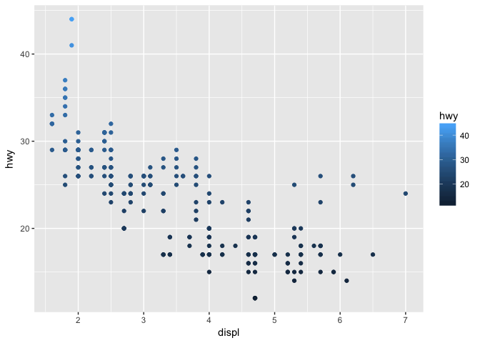

3.3.1 Solutions
================

The following questions stem from [Section 3.3](http://r4ds.had.co.nz/data-visualisation.html#aesthetic-mappings) of Chapter 3 (Data Visualization) in [R for Data Science](http://r4ds.had.co.nz/). The "solutions" offer some answers. Issues and pull requests are very welcome here.

### Load packages

``` r
library(tidyverse)
```

#### 1. What's gone wrong with this code? Why are the points not blue?

``` r
ggplot(data = mpg) +
  geom_point(mapping = aes(x = displ, y = hwy, color = "blue"))
```


The `color` aesthetic needs to be set outside of the `aes` function, as follows:

``` r
ggplot(data = mpg) +
  geom_point(mapping = aes(x = displ, y = hwy), color = "blue")
```


#### 2. Which variables in `mpg` are categorical? Which variables are continuous? (Hint: type `?mpg` to read the documentation for the dataset.)

Categorical: `manufacturer`, `model`, `year`, `trans`, `drv`, `fl`, and `class`.

Continuous: `displ`, `cyl`, `cty`, and `hwy`.

#### How can you see this information when you run `mpg`?

``` r
mpg
```

    ## # A tibble: 234 x 11
    ##    manufacturer model    displ  year   cyl trans   drv     cty   hwy fl   
    ##    <chr>        <chr>    <dbl> <int> <int> <chr>   <chr> <int> <int> <chr>
    ##  1 audi         a4        1.80  1999     4 auto(l… f        18    29 p    
    ##  2 audi         a4        1.80  1999     4 manual… f        21    29 p    
    ##  3 audi         a4        2.00  2008     4 manual… f        20    31 p    
    ##  4 audi         a4        2.00  2008     4 auto(a… f        21    30 p    
    ##  5 audi         a4        2.80  1999     6 auto(l… f        16    26 p    
    ##  6 audi         a4        2.80  1999     6 manual… f        18    26 p    
    ##  7 audi         a4        3.10  2008     6 auto(a… f        18    27 p    
    ##  8 audi         a4 quat…  1.80  1999     4 manual… 4        18    26 p    
    ##  9 audi         a4 quat…  1.80  1999     4 auto(l… 4        16    25 p    
    ## 10 audi         a4 quat…  2.00  2008     4 manual… 4        20    28 p    
    ## # ... with 224 more rows, and 1 more variable: class <chr>

Running `mpg` displays the `mpg` data as a tibble. Under the variables' names, you can see their corresponding variable types, which are enclosed within arrows (e.g., below `manufacturer`, you see &lt;chr&gt;). Characters (chr), factors (fctr), and logicals (lgl) are all categorical variables, whereas integers (int) and floating point numbers (dbl) are both continuous variables.

#### 3. Map a continuous variable to `color`, `size`, and `shape`. How do these aesthetics behave differently for categorical vs. continuous variables?

For the `color` aesthetic, continuous variables get mapped along a color spectrum.

``` r
ggplot(data = mpg) +
  geom_point(mapping = aes(x = displ, y = hwy, color = cyl))
```


Encoding `cyl`, the number of cylinders in a vehicle, as a categorical variable "fixes" this issue, such that vehicles with different numbers of cylinders get assigned to different colors.

``` r
ggplot(data = mpg) +
  geom_point(mapping = aes(x = displ, y = hwy, color = as.factor(cyl)))
```


For continuous variables that are discrete and have a small number values, the next plot shows that the `size` aesthetic behaves the same with continuous variables as it does with categorical variables.

``` r
ggplot(data = mpg) +
  geom_point(mapping = aes(x = displ, y = hwy, size = cyl))
```


For the `shape` aesthetic, R returns an error message (i.e., "Error: A continuous variable cannot be mapped to shape").

``` r
ggplot(data = mpg) +
  geom_point(mapping = aes(x = displ, y = hwy, shape = cyl))
```

#### 4. What happens if you map the same variable to multiple aesthetics?

Mapping a variable to the x or y axis as well as to another aesthetic creates redundancy. For example, in the next plot, the y axis and the legend provide redundant information.

``` r
ggplot(data = mpg) +
  geom_point(mapping = aes(x = displ, y = hwy, color = hwy))
```



#### 5. What does the `stroke` aesthetic do? What shapes does it work with? (Hint: use `?geom_point`.)

The `stroke` aesthetic modifies the width of a data point's borders. It only works for shapes 21-24.

``` r
ggplot(data = mpg) +
  geom_point(mapping = aes(x = displ, y = hwy), shape = 22, stroke = .8)
```


#### 6. What happens if you map an aesthetic to something other than a variable name, like `aes(colour = displ < 5)`?

`ggplot` uses logical arguments (like `aes(colour = displ < 5)`) to map values from data (like `displ == 6`) to levels of aesthetic properties (like `"red"`). In this case, the decision rule determines what color the data points get assigned.

``` r
ggplot(data = mpg) +
  geom_point(mapping = aes(x = displ, y = hwy, color = displ < 5))
```


