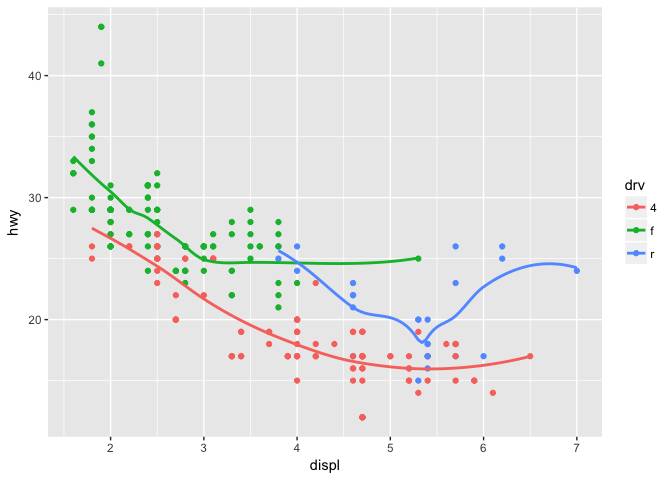
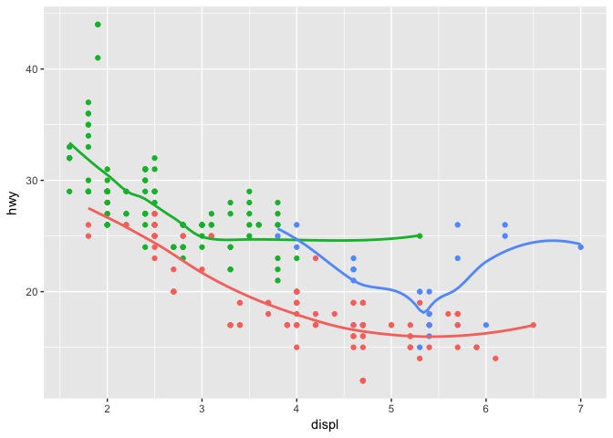
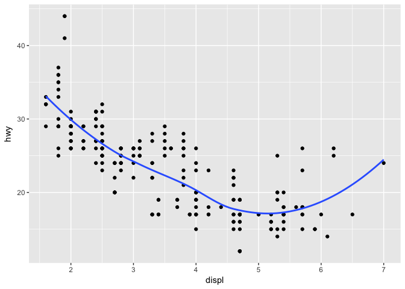
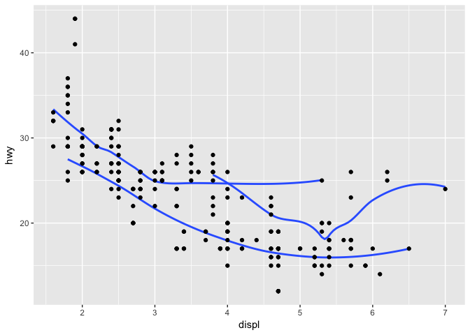
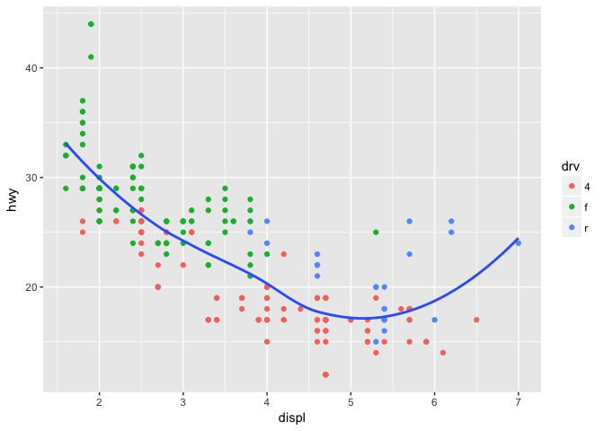
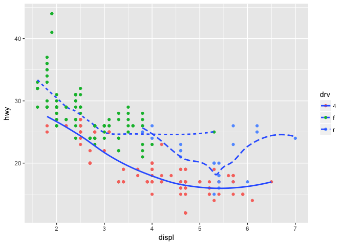
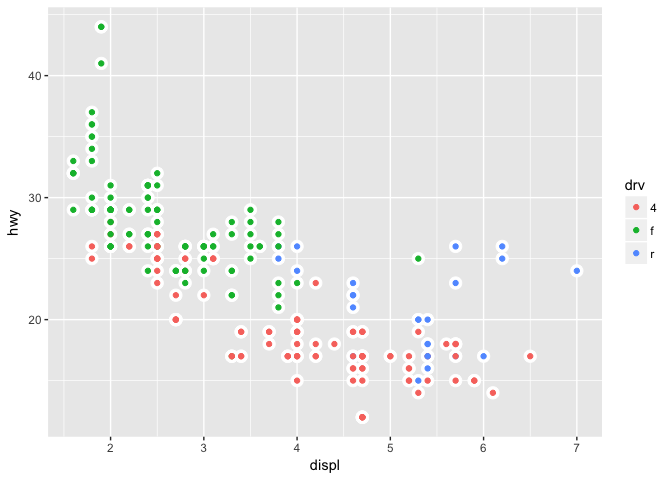

3.6.1 Solutions
================

The following questions stem from [Section 3.6](http://r4ds.had.co.nz/data-visualisation.html#exercises-3) of Chapter 3 (Data Visualization) in [R for Data Science](http://r4ds.had.co.nz/). The "solutions" offer some answers. Issues and pull requests are very welcome here.

### Load packages

``` r
library(tidyverse)
```

#### 1. What `geom` would you use to draw a line chart? A boxplot? A histogram? An area chart?

For a line chart, use `geom_line()`. For a boxplot, use `geom_boxplot()`. For a histogram, use `geom_histogram()`. For an area chart, use `geom_area()`.

#### 2. Run this code in your head and predict what the output will look like. Then, run the code in R and check your predictions.

``` r
ggplot(data = mpg, mapping = aes(x = displ, y = hwy, color = drv)) + 
  geom_point() + 
  geom_smooth(se = FALSE)
```

Mental prediction: The canvas of the plot will have `displ` on the x axis and `hwy` on the y axis. The data will be represented by two visual objects, points and lines. These visual objects will be colored according to the drivetrains of the vehicles. A legend will be rendered. Standard errors around the lowess lines will not be displayed.

The output of the code confirms this mental prediction:



#### 3. What does `show.legend = FALSE` do? What happens if you remove it? Why do you think I used it earlier in the chapter?

`show.legend = FALSE` removes legends from plots. For example, including `show.legend = FALSE` as an option in `geom_point()` and `geom_smooth()` removes the legend from the last plot.

``` r
ggplot(data = mpg, mapping = aes(x = displ, y = hwy, color = drv)) + 
  geom_point(show.legend = FALSE) + 
  geom_smooth(se = FALSE, show.legend = FALSE)
```



`show.legend = FALSE` was used earlier in the chapter to emphasize the advantage of using aesthetics such as `color` and `linetype` vis-à-vis the `group` aesthetic. Whereas the `group` aesthetic draws "a separate object for each unique value of the grouping variable," `color` and `linetype` add distinguishing features to the geoms of different groups as well as a legend that allows readers to connect values in the data to levels (e.g., colors, shapes, or line types) in the visualization [(Grolemund and Wickham 2017)](http://r4ds.had.co.nz/data-visualisation.html#geometric-objects).

#### 4. What does the `se` argument to `geom_smooth()` do?

The `se` argument adds a translucent confidence interval to a smooth line.

#### Will these two graphs look different? Why/why not?

``` r
ggplot(data = mpg, mapping = aes(x = displ, y = hwy)) + 
  geom_point() + 
  geom_smooth()

ggplot() + 
  geom_point(data = mpg, mapping = aes(x = displ, y = hwy)) + 
  geom_smooth(data = mpg, mapping = aes(x = displ, y = hwy))
```

The graphs will be identical, although the first is more efficient. It enters the `data` and `mapping` arguments into the global `ggplot()` function, whereas the second enters them into the `geom_point()` and `geom_smooth()` visual objects separately.

#### 5. Recreate the R code necessary to generate the following graphs.

``` r
ggplot(data = mpg, aes(x = displ, y = hwy)) +
  geom_point() + 
  geom_smooth(se = FALSE)
```



``` r
ggplot(data = mpg, aes(x = displ, y = hwy)) +
  geom_smooth(aes(class = drv), se = FALSE) +
  geom_point()
```



``` r
ggplot(data = mpg, aes(x = displ, y = hwy)) +
  geom_point(aes(color = drv)) + 
  geom_smooth(aes(color = drv), se = FALSE)
```


``` r
ggplot(data = mpg, aes(x = displ, y = hwy)) +
  geom_point(aes(color = drv)) + 
  geom_smooth(se = FALSE)
```



``` r
ggplot(data = mpg, aes(x = displ, y = hwy)) +
  geom_point(aes(color = drv)) +
  geom_smooth(aes(linetype = drv), se = FALSE)
```



``` r
ggplot(data = mpg, aes(x = displ, y = hwy)) + 
  geom_point(size = 4, color = "white") + 
  geom_point(aes(color = drv))
```


